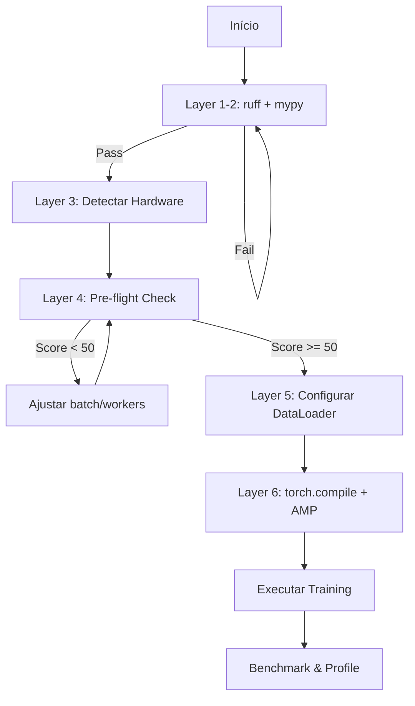

# Advanced Layered Engineering Skill

Skill unificada que aplica engenharia de software avançada em 6 camadas progressivas, desde conformidade PEP até otimizações profundas de hardware e memória.

---

## Arquitetura de Camadas

```
┌─────────────────────────────────────────────────────────────────────┐
│                    L6: DEEP OPTIMIZATION                            │
│          torch.compile(), max-autotune, kernel fusion               │
├─────────────────────────────────────────────────────────────────────┤
│                    L5: PARALLEL PROCESSING                          │
│     DataLoader workers, prefetch, CUDA streams, non-blocking        │
├─────────────────────────────────────────────────────────────────────┤
│                    L4: MEMORY ARCHITECTURE                          │
│    VRAM estimation, gradient checkpointing, AMP, ThermalGuard       │
├─────────────────────────────────────────────────────────────────────┤
│                    L3: HARDWARE PROFILING                           │
│         Auto-detection, profiles, device optimization               │
├─────────────────────────────────────────────────────────────────────┤
│                    L2: TYPE SYSTEM                                  │
│              MyPy strict, generics, Optional handling               │
├─────────────────────────────────────────────────────────────────────┤
│                    L1: PEP FOUNDATION                               │
│             Ruff, Black, isort, PEP8/PEP257 compliance              │
└─────────────────────────────────────────────────────────────────────┘
```

---

## Layer 1: PEP Foundation (Sintaxe & Padrões)

**Foco:** Código sintaticamente correto e legível

### Ferramentas
- **Ruff**: Linting ultrarrápido (substitui Flake8, pyupgrade)
- **Black**: Formatação determinística
- **isort**: Organização de imports

### Comandos

```bash
# Verificar
ruff check src/ --select E,W,F,I,N,D

# Corrigir
ruff check src/ --fix && ruff format src/
```

### Checklist
- [ ] Zero erros de sintaxe
- [ ] Formatação PEP8 via Black (line-length=88)
- [ ] Imports ordenados (stdlib → third-party → local)
- [ ] Docstrings Google Style em módulos públicos

---

## Layer 2: Type System (Robustez Estática)

**Foco:** Tipos consistentes e previsíveis

### Ferramentas
- **MyPy**: Verificação estática em modo strict

### Configuração

```toml
# pyproject.toml
[tool.mypy]
python_version = "3.11"
strict = true
warn_return_any = true
disallow_untyped_defs = true
```

### Comandos

```bash
# Verificar tipos
mypy src/ --strict

# Ignorar erros específicos inline
# x: int = some_func()  # type: ignore[assignment]
```

### Checklist
- [ ] `strict = true` ativo
- [ ] Sem `Any` implícito
- [ ] Generics tipados (`list[str]`, não `list`)
- [ ] `Optional[T]` com tratamento exaustivo

---

## Layer 3: Hardware Profiling (Detecção & Otimização)

**Foco:** Configuração automática baseada em hardware

### Módulos do Projeto

```python
from src.config.hardware import get_profile, optimize_model_for_hardware
from src.config.hardware_intel import HardwareIntelligence
```

### Profiles Disponíveis

| Profile | Device | Batch | Workers | AMP | Compile |
|---------|--------|-------|---------|-----|---------|
| `cpu` | CPU | 16 | 2 | ❌ | ❌ |
| `cpu_low` | CPU | 8 | 0 | ❌ | ❌ |
| `gpu` | CUDA | 64 | 8 | ✅ | ✅ |
| `gpu_rtx3060` | CUDA | 96 | 12 | ✅ | ✅ |
| `gpu_low_vram` | CUDA | 32 | 4 | ✅ | ✅ |

### Comandos

```bash
# Relatório de hardware
python -c "from src.config.hardware_intel import HardwareIntelligence; HardwareIntelligence().print_report()"

# Seleção interativa
python -c "from src.config.hardware import select_hardware_interactive; p = select_hardware_interactive(); print(p)"
```

### Uso em Código

```python
# Auto-detecção
profile = get_profile("auto")

# Aplicar otimizações ao modelo
model = optimize_model_for_hardware(model, profile)

# Channels Last para GPU (melhor cache)
if profile.device == "cuda":
    model = model.to(memory_format=torch.channels_last)
```

### Checklist
- [ ] Profile selecionado automaticamente ou explicitamente
- [ ] Batch size adequado para VRAM disponível
- [ ] Channels Last ativo em GPU
- [ ] torch.compile() ativado se suportado

---

## Layer 4: Memory Architecture (Alocação Inteligente)

**Foco:** Uso eficiente de RAM/VRAM

### Pre-flight Validation

```python
from src.config.hardware_intel import run_preflight_checks

result = run_preflight_checks(
    batch_size=32,
    epochs=10,
    dataset_size=50000,
    strict=True,
    verbose=True,
)

if not result.can_proceed:
    raise RuntimeError(f"Pre-flight failed: {result.errors}")

print(f"Score: {result.score}/100")
print(f"Recommended batch: {result.estimate.recommended_batch_size}")
```

### VRAM Estimation

```python
from src.config.hardware_intel import HardwareIntelligence

hw = HardwareIntelligence()
estimate = hw.estimate_resources(
    batch_size=32,
    epochs=10,
    dataset_size=10000,
    model_params=5_000_000,
)

print(f"Total Memory: {estimate.total_memory_gb:.2f} GB")
print(f"Epoch Time: {estimate.estimated_epoch_time_min:.1f} min")
```

### Gradient Checkpointing

```python
from torch.utils.checkpoint import checkpoint_sequential

# Reduz VRAM em ~70%, aumenta tempo em ~20%
output = checkpoint_sequential(model.layers, segments=4, input)
```

### Mixed Precision (AMP)

```python
from torch.cuda.amp import autocast, GradScaler

scaler = GradScaler()

with autocast(dtype=torch.float16):
    output = model(input)
    loss = criterion(output, target)

scaler.scale(loss).backward()
scaler.step(optimizer)
scaler.update()
```

### ThermalGuard (CPU Throttling)

```python
from src.config.hardware_intel import ThermalGuard

# Limita threads e insere sleep entre batches
guard = ThermalGuard(cpu_threads=2, sleep_ms=5)

for batch in dataloader:
    # ... process batch ...
    guard.sleep_between_batches()

guard.restore_threads()
```

### Checklist
- [ ] Pre-flight score > 80/100
- [ ] VRAM usage < 85% estimado
- [ ] Gradient checkpointing se necessário
- [ ] ThermalGuard ativo em CPU constrained

---

## Layer 5: Parallel Processing (Concorrência)

**Foco:** Maximizar throughput de dados

### DataLoader Optimization

```python
from src.config.hardware import get_dataloader_kwargs

kwargs = get_dataloader_kwargs(profile)
# Returns: {num_workers, pin_memory, prefetch_factor, persistent_workers}

loader = DataLoader(
    dataset,
    batch_size=profile.batch_size,
    **kwargs,
)
```

### Tuning de Workers

| Hardware | num_workers | prefetch_factor | Motivo |
|----------|-------------|-----------------|--------|
| GPU + SSD | `min(cpu_cores, 8)` | 4 | I/O rápido |
| GPU + HDD | `min(cpu_cores, 4)` | 2 | I/O lento |
| CPU-only | `min(cpu_cores, 2)` | 1 | Evitar competição |

### Non-blocking Transfer

```python
# Transferência assíncrona CPU → GPU
images = images.to(device, non_blocking=True)
targets = targets.to(device, non_blocking=True)

# CUDA streams executam em paralelo com compute
```

### Pin Memory

```python
# Acelera transferência para GPU (evita paging)
loader = DataLoader(
    dataset,
    pin_memory=True,  # Somente com GPU
    num_workers=8,
)
```

### Checklist
- [ ] `num_workers` proporcional a CPU cores
- [ ] `pin_memory=True` com GPU
- [ ] `persistent_workers=True` entre epochs
- [ ] `non_blocking=True` em transfers

---

## Layer 6: Deep Optimization (Performance Avançada)

**Foco:** Otimizações de baixo nível

### torch.compile() (PyTorch 2.0+)

```python
import torch

# Modos disponíveis
model = torch.compile(model, mode="reduce-overhead")  # Menor latência
model = torch.compile(model, mode="max-autotune")     # Máxima performance
model = torch.compile(model, mode="default")          # Balanceado
```

**Ganhos:**
- 10-30% mais rápido após warmup
- Fusão automática de operações
- Compatível com AMP

### Kernel Fusion com XLA (Opcional)

```python
# Para modelos JAX/TPU
@jax.jit
def train_step(params, batch):
    loss, grads = jax.value_and_grad(loss_fn)(params)
    return loss, grads
```

### Benchmarking

```bash
# Benchmark com pytest-benchmark
pytest tests/perf/ --benchmark-only --benchmark-autosave

# Comparar com baseline
pytest --benchmark-compare
```

### Checklist
- [ ] `torch.compile()` ativo em produção
- [ ] Warmup de 3-5 batches antes de medir
- [ ] Benchmarks salvos para comparação
- [ ] GPU utilization > 80%

---

## Comandos de Verificação

### Verificação Completa (Todas as Camadas)

```bash
python .agent/skills/advanced-layered-engineering/scripts/verify_layers.py --all
```

### Verificação por Camada

```bash
# Layer 1: PEP
python .agent/skills/advanced-layered-engineering/scripts/verify_layers.py --layer 1

# Layer 3: Hardware
python .agent/skills/advanced-layered-engineering/scripts/verify_layers.py --layer 3

# Layer 4: Pre-flight
python .agent/skills/advanced-layered-engineering/scripts/verify_layers.py --preflight
```

---

## Fluxo de Trabalho Recomendado



---

## 🔥 Layer 7: Advanced Optimizations (Performance Extrema)

Esta camada contém técnicas de otimização de ponta para maximizar performance em produção.

---

### 7.1 CUDA Graph Capture (Latência Zero)

Captura operações CUDA em um grafo para replay instantâneo sem overhead de dispatch.

```python
import torch

# Preparar inputs estáticos (tamanho fixo)
static_input = torch.randn(32, 3, 224, 224, device="cuda")
static_target = torch.randint(0, 14, (32,), device="cuda")

# Warmup (necessário antes de captura)
for _ in range(3):
    output = model(static_input)
    loss = criterion(output, static_target)
    loss.backward()
    optimizer.step()
    optimizer.zero_grad()

# Capturar grafo
cuda_graph = torch.cuda.CUDAGraph()
with torch.cuda.graph(cuda_graph):
    output = model(static_input)
    loss = criterion(output, static_target)
    loss.backward()
    optimizer.step()
    optimizer.zero_grad()

# Replay - 10-50% mais rápido que eager
for batch in dataloader:
    static_input.copy_(batch[0])
    static_target.copy_(batch[1])
    cuda_graph.replay()
```

**Requisitos:**
- Batch size fixo
- Shapes de tensor constantes
- CUDA 11.0+
- Stream único

---

### 7.2 Adaptive Batch Scheduling (Auto-Scaling)

Ajusta batch_size dinamicamente baseado em uso de VRAM.

```python
import torch


class AdaptiveBatchScheduler:
    """Scheduler que ajusta batch size baseado em VRAM."""

    def __init__(
        self,
        initial_batch: int = 32,
        min_batch: int = 8,
        max_batch: int = 256,
        target_vram: float = 0.85,
    ):
        self.batch_size = initial_batch
        self.min_batch = min_batch
        self.max_batch = max_batch
        self.target_vram = target_vram
        self._history: list[float] = []

    def get_vram_usage(self) -> float:
        """Retorna fração de VRAM em uso."""
        if not torch.cuda.is_available():
            return 0.0
        allocated = torch.cuda.memory_allocated()
        total = torch.cuda.get_device_properties(0).total_memory
        return allocated / total

    def step(self) -> int:
        """Ajusta batch size e retorna novo valor."""
        usage = self.get_vram_usage()
        self._history.append(usage)

        # Média móvel dos últimos 5 steps
        avg_usage = sum(self._history[-5:]) / len(self._history[-5:])

        if avg_usage > 0.95:
            # Crítico - reduzir imediatamente
            self.batch_size = max(self.min_batch, self.batch_size // 2)
        elif avg_usage > self.target_vram:
            # Acima do target - reduzir gradualmente
            self.batch_size = max(self.min_batch, self.batch_size - 4)
        elif avg_usage < self.target_vram - 0.15:
            # Muito abaixo - aumentar
            self.batch_size = min(self.max_batch, self.batch_size + 8)

        return self.batch_size


# Uso
scheduler = AdaptiveBatchScheduler(initial_batch=64)
for epoch in range(epochs):
    new_batch = scheduler.step()
    if new_batch != current_batch:
        train_loader = DataLoader(dataset, batch_size=new_batch)
        print(f"Batch size adjusted to {new_batch}")
```

---

### 7.3 Memory Pool Allocation (Pré-alocação Vetorial)

Pré-aloca tensores para evitar fragmentação de memória.

```python
import torch
from typing import Iterator


class TensorPool:
    """Pool de tensores pré-alocados para reutilização."""

    def __init__(
        self,
        shape: tuple[int, ...],
        pool_size: int = 16,
        device: str = "cuda",
        pin_memory: bool = True,
    ):
        self.shape = shape
        self.pool_size = pool_size
        self.device = device

        # Pré-alocar pool contíguo
        if device == "cuda":
            self.pool = torch.empty(pool_size, *shape, device=device)
        else:
            self.pool = torch.empty(
                pool_size, *shape,
                pin_memory=pin_memory,
            )

        self._index = 0
        self._in_use: set[int] = set()

    def acquire(self) -> torch.Tensor:
        """Adquire tensor do pool."""
        if len(self._in_use) >= self.pool_size:
            raise RuntimeError("Pool exausto")

        while self._index in self._in_use:
            self._index = (self._index + 1) % self.pool_size

        tensor = self.pool[self._index]
        self._in_use.add(self._index)
        self._index = (self._index + 1) % self.pool_size
        return tensor

    def release(self, tensor: torch.Tensor) -> None:
        """Libera tensor de volta ao pool."""
        for i in range(self.pool_size):
            if self.pool[i].data_ptr() == tensor.data_ptr():
                self._in_use.discard(i)
                return

    def __iter__(self) -> Iterator[torch.Tensor]:
        """Itera sobre todos os tensores do pool."""
        for i in range(self.pool_size):
            yield self.pool[i]


# Uso - evita alocações repetidas
image_pool = TensorPool((3, 224, 224), pool_size=32, device="cuda")

for raw_batch in dataloader:
    buffer = image_pool.acquire()
    buffer.copy_(raw_batch)  # Copia sem alocar
    output = model(buffer.unsqueeze(0))
    image_pool.release(buffer)
```

---

### 7.4 INT8 Dynamic Quantization (Inferência 4x Mais Rápida)

Quantização dinâmica para serving de modelos.

```python
import torch
import torch.quantization as quant


def quantize_for_inference(model: torch.nn.Module) -> torch.nn.Module:
    """Aplica quantização INT8 dinâmica para inferência."""
    model.eval()

    # Quantização dinâmica - pesos convertidos para INT8
    quantized = quant.quantize_dynamic(
        model,
        {torch.nn.Linear, torch.nn.Conv2d},
        dtype=torch.qint8,
    )

    return quantized


def benchmark_quantized(model: torch.nn.Module, input_tensor: torch.Tensor) -> dict:
    """Compara performance antes e depois de quantização."""
    import time

    # Original
    model.eval()
    with torch.no_grad():
        start = time.perf_counter()
        for _ in range(100):
            _ = model(input_tensor)
        original_time = (time.perf_counter() - start) / 100

    # Quantizado
    q_model = quantize_for_inference(model)
    with torch.no_grad():
        start = time.perf_counter()
        for _ in range(100):
            _ = q_model(input_tensor.cpu())  # Quantização em CPU
        quantized_time = (time.perf_counter() - start) / 100

    return {
        "original_ms": original_time * 1000,
        "quantized_ms": quantized_time * 1000,
        "speedup": original_time / quantized_time,
    }


# Uso
quantized_model = quantize_for_inference(model)
torch.save(quantized_model.state_dict(), "model_int8.pth")
```

---

### 7.5 Async Prefetch Pipeline (I/O Overlapped)

Pipeline assíncrono de 3 estágios para overlapping de I/O e compute.

```python
import asyncio
import torch
from concurrent.futures import ThreadPoolExecutor
from typing import AsyncIterator, Any


class AsyncPrefetchPipeline:
    """Pipeline de 3 estágios: Load → Transfer → Compute."""

    def __init__(
        self,
        dataloader: torch.utils.data.DataLoader,
        device: torch.device,
        prefetch_count: int = 2,
    ):
        self.dataloader = dataloader
        self.device = device
        self.prefetch_count = prefetch_count
        self._executor = ThreadPoolExecutor(max_workers=2)
        self._queue: asyncio.Queue = asyncio.Queue(maxsize=prefetch_count)

    async def _load_and_transfer(self, batch: Any) -> tuple[torch.Tensor, torch.Tensor]:
        """Stage 1+2: Load and transfer to GPU."""
        loop = asyncio.get_event_loop()

        def transfer():
            images, labels = batch
            return (
                images.to(self.device, non_blocking=True),
                labels.to(self.device, non_blocking=True),
            )

        return await loop.run_in_executor(self._executor, transfer)

    async def _producer(self) -> None:
        """Produz batches transferidos."""
        for batch in self.dataloader:
            gpu_batch = await self._load_and_transfer(batch)
            await self._queue.put(gpu_batch)
        await self._queue.put(None)  # Sentinel

    async def __aiter__(self) -> AsyncIterator[tuple[torch.Tensor, torch.Tensor]]:
        """Itera sobre batches pré-carregados."""
        asyncio.create_task(self._producer())

        while True:
            batch = await self._queue.get()
            if batch is None:
                break
            yield batch

    def __del__(self) -> None:
        self._executor.shutdown(wait=False)


# Uso com asyncio
async def train_with_pipeline(model, dataloader, device):
    pipeline = AsyncPrefetchPipeline(dataloader, device)

    async for images, labels in pipeline:
        # Compute enquanto próximo batch carrega
        output = model(images)
        loss = criterion(output, labels)
        loss.backward()
        optimizer.step()
```

---

### 7.6 Gradient Accumulation (Batch Virtual Grande)

Simula batches maiores acumulando gradientes.

```python
import torch


class GradientAccumulator:
    """Acumulador de gradientes para batch virtual."""

    def __init__(
        self,
        model: torch.nn.Module,
        optimizer: torch.optim.Optimizer,
        accumulation_steps: int = 4,
        max_grad_norm: float = 1.0,
    ):
        self.model = model
        self.optimizer = optimizer
        self.accumulation_steps = accumulation_steps
        self.max_grad_norm = max_grad_norm
        self._step_count = 0

    def backward(self, loss: torch.Tensor) -> bool:
        """Backward com acumulação. Retorna True se fez optimizer step."""
        # Escalar loss para média correta
        scaled_loss = loss / self.accumulation_steps
        scaled_loss.backward()

        self._step_count += 1

        if self._step_count >= self.accumulation_steps:
            # Clip gradients
            torch.nn.utils.clip_grad_norm_(
                self.model.parameters(),
                self.max_grad_norm,
            )

            # Optimizer step
            self.optimizer.step()
            self.optimizer.zero_grad()
            self._step_count = 0
            return True

        return False

    @property
    def effective_batch_size(self) -> int:
        """Retorna batch size virtual."""
        return self.accumulation_steps


# Uso - batch virtual de 128 com batch real de 32
accumulator = GradientAccumulator(
    model, optimizer,
    accumulation_steps=4,  # 32 * 4 = 128 virtual
)

for images, labels in dataloader:  # batch_size=32
    output = model(images)
    loss = criterion(output, labels)

    if accumulator.backward(loss):
        print(f"Step completed with virtual batch {accumulator.effective_batch_size}")
```

---

### 7.7 Deep Observability (Telemetria Estruturada)

Observabilidade profunda com OpenTelemetry e métricas customizadas.

```python
from opentelemetry import trace, metrics
from opentelemetry.sdk.trace import TracerProvider
from opentelemetry.sdk.metrics import MeterProvider
from contextlib import contextmanager
import time


class TrainingObserver:
    """Observador de treinamento com telemetria estruturada."""

    def __init__(self, service_name: str = "vitruviano-training"):
        # Tracer para spans
        self.tracer = trace.get_tracer(service_name)

        # Meter para métricas
        self.meter = metrics.get_meter(service_name)

        # Métricas customizadas
        self.loss_histogram = self.meter.create_histogram(
            "training.loss",
            description="Training loss distribution",
        )
        self.throughput_counter = self.meter.create_counter(
            "training.samples_processed",
            description="Total samples processed",
        )
        self.gpu_memory_gauge = self.meter.create_observable_gauge(
            "training.gpu_memory_gb",
            callbacks=[self._get_gpu_memory],
        )

    def _get_gpu_memory(self) -> float:
        """Callback para GPU memory gauge."""
        import torch
        if torch.cuda.is_available():
            return torch.cuda.memory_allocated() / (1024**3)
        return 0.0

    @contextmanager
    def trace_epoch(self, epoch: int, **attributes):
        """Trace uma época inteira."""
        with self.tracer.start_as_current_span("training_epoch") as span:
            span.set_attribute("epoch", epoch)
            for k, v in attributes.items():
                span.set_attribute(k, v)

            start = time.perf_counter()
            yield span
            duration = time.perf_counter() - start

            span.set_attribute("duration_seconds", duration)

    @contextmanager
    def trace_batch(self, batch_idx: int):
        """Trace um batch."""
        with self.tracer.start_as_current_span("training_batch") as span:
            span.set_attribute("batch_idx", batch_idx)
            yield span

    def record_loss(self, loss: float, labels: dict[str, str] | None = None):
        """Registra loss no histograma."""
        self.loss_histogram.record(loss, labels or {})

    def record_samples(self, count: int):
        """Incrementa contador de samples."""
        self.throughput_counter.add(count)


# Uso
observer = TrainingObserver()

for epoch in range(epochs):
    with observer.trace_epoch(epoch, learning_rate=lr):
        for batch_idx, (images, labels) in enumerate(dataloader):
            with observer.trace_batch(batch_idx):
                output = model(images)
                loss = criterion(output, labels)
                loss.backward()
                optimizer.step()

                observer.record_loss(loss.item())
                observer.record_samples(len(images))
```

---

### 7.8 Neural Architecture Search (NAS) Integrado

Busca automatizada de arquitetura com Ray Tune.

```python
from ray import tune
from ray.tune.schedulers import ASHAScheduler
from ray.tune.search.optuna import OptunaSearch
import torch.nn as nn


def build_model(config: dict) -> nn.Module:
    """Constrói modelo baseado em config do NAS."""
    layers = []

    # Input layer
    in_features = 3 * 224 * 224

    # Hidden layers
    for i in range(config["num_layers"]):
        out_features = config["hidden_dim"]
        layers.append(nn.Linear(in_features, out_features))
        layers.append(nn.ReLU())

        if config["use_dropout"]:
            layers.append(nn.Dropout(config["dropout_rate"]))

        in_features = out_features

    # Output layer
    layers.append(nn.Linear(in_features, 14))

    return nn.Sequential(*layers)


def train_fn(config: dict) -> None:
    """Função de treino para NAS."""
    model = build_model(config)
    optimizer = torch.optim.AdamW(
        model.parameters(),
        lr=config["lr"],
        weight_decay=config["weight_decay"],
    )

    for epoch in range(10):
        # Training loop simplificado
        train_loss = train_epoch(model, train_loader, optimizer)
        val_auc = validate(model, val_loader)

        # Report metrics to Ray Tune
        tune.report(loss=train_loss, auc=val_auc)


# Configuração do espaço de busca
search_space = {
    "hidden_dim": tune.choice([128, 256, 512, 1024]),
    "num_layers": tune.randint(2, 8),
    "dropout_rate": tune.uniform(0.1, 0.5),
    "use_dropout": tune.choice([True, False]),
    "lr": tune.loguniform(1e-5, 1e-2),
    "weight_decay": tune.loguniform(1e-6, 1e-2),
}

# Scheduler ASHA para early stopping
scheduler = ASHAScheduler(
    max_t=10,           # Max epochs
    grace_period=2,     # Min epochs antes de parar
    reduction_factor=2, # Fator de redução
)

# Executar busca
analysis = tune.run(
    train_fn,
    config=search_space,
    num_samples=50,
    scheduler=scheduler,
    search_alg=OptunaSearch(),
    metric="auc",
    mode="max",
    resources_per_trial={"cpu": 2, "gpu": 0.5},
)

# Melhor configuração
best_config = analysis.best_config
print(f"Best config: {best_config}")
print(f"Best AUC: {analysis.best_result['auc']}")
```

---

## Métricas de Sucesso (Atualizado)

| Métrica | Target | Ferramenta |
|---------|--------|------------|
| Lint errors | 0 | Ruff |
| Type errors | 0 | MyPy |
| Pre-flight score | ≥ 80 | hardware_intel |
| GPU utilization | ≥ 80% | nvidia-smi |
| Dataloader throughput | ≥ 1000 samples/s | pytest-benchmark |
| Memory leaks | 0 | memory_profiler |
| **CUDA Graph speedup** | ≥ 1.3x | benchmark |
| **Quantization speedup** | ≥ 2x | benchmark |
| **Gradient accumulation** | linear scaling | metrics |

---

## Referências

- [DOC_TREINAMENTO_TECNICO.md](file:///d:/source/Project-Vitruviano/DOC_TREINAMENTO_TECNICO.md)
- [hardware.py](file:///d:/source/Project-Vitruviano/src/config/hardware.py)
- [hardware_intel.py](file:///d:/source/Project-Vitruviano/src/config/hardware_intel.py)
- [PyTorch 2.0 Compile](https://pytorch.org/tutorials/intermediate/torch_compile_tutorial.html)
- [Mixed Precision Training](https://pytorch.org/docs/stable/notes/amp_examples.html)
- [CUDA Graphs](https://pytorch.org/blog/accelerating-pytorch-with-cuda-graphs/)
- [Ray Tune NAS](https://docs.ray.io/en/latest/tune/index.html)
- [OpenTelemetry Python](https://opentelemetry.io/docs/instrumentation/python/)
