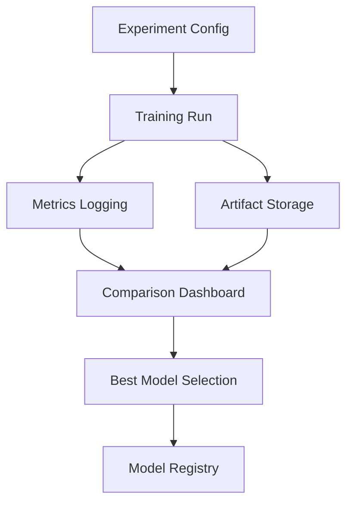
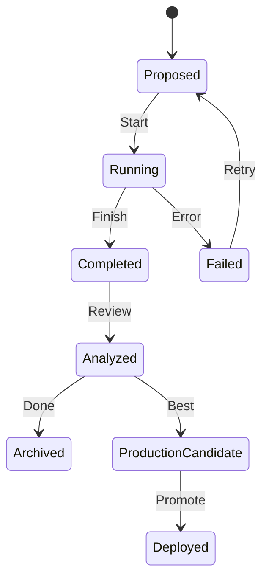

# Experiment Tracking Skill

## Objetivo

Gerenciar experimentos de ML de forma sistemática, garantindo reprodutibilidade, comparabilidade e documentação automática.

---

## Componentes



---

## Estrutura de Experimento

```yaml
# experiments/exp_001_baseline.yaml
experiment:
  name: "baseline-classifier"
  description: "Initial baseline with ResNet-50"
  author: "team"
  created: "2024-01-15"

hypothesis:
  question: "Does ResNet-50 provide better AUC than VGG-16?"
  expected: "AUC improvement of 5%+"

config:
  model:
    architecture: "resnet50"
    pretrained: true
    num_classes: 2

  training:
    epochs: 100
    batch_size: 32
    learning_rate: 0.001
    optimizer: "AdamW"
    scheduler: "cosine"

  data:
    train_split: 0.8
    val_split: 0.1
    test_split: 0.1
    augmentations: ["horizontal_flip", "rotation", "color_jitter"]

  seed: 42

metrics_to_track:
  primary: "val_auc"
  secondary: ["val_accuracy", "val_f1", "train_loss"]

tags:
  - "baseline"
  - "resnet"
  - "v1"
```

---

## Logging de Experimentos

### Integração MLflow

```python
import mlflow
from datetime import datetime

def log_experiment(config: dict, metrics: dict, artifacts: list[str]):
    """Log experimento completo no MLflow."""

    mlflow.set_experiment(config["experiment"]["name"])

    with mlflow.start_run(run_name=f"run_{datetime.now():%Y%m%d_%H%M}"):
        # Tags
        mlflow.set_tags({
            "author": config["experiment"]["author"],
            "hypothesis": config["hypothesis"]["question"][:250],
        })

        # Params
        mlflow.log_params(flatten_dict(config["config"]))

        # Metrics
        for name, value in metrics.items():
            if isinstance(value, list):
                for i, v in enumerate(value):
                    mlflow.log_metric(name, v, step=i)
            else:
                mlflow.log_metric(name, value)

        # Artifacts
        for path in artifacts:
            mlflow.log_artifact(path)

        # Model
        mlflow.pytorch.log_model(model, "model")
```

### Logging Manual (JSON)

```python
import json
from pathlib import Path
from datetime import datetime, UTC

def save_experiment_log(
    experiment_dir: Path,
    config: dict,
    metrics: dict,
    history: dict,
) -> Path:
    """Salva log de experimento em JSON."""

    log = {
        "timestamp": datetime.now(UTC).isoformat(),
        "config": config,
        "final_metrics": metrics,
        "training_history": history,
    }

    log_path = experiment_dir / f"experiment_log_{datetime.now():%Y%m%d_%H%M%S}.json"
    log_path.write_text(json.dumps(log, indent=2))

    return log_path
```

---

## Comparação de Experimentos

### Script de Comparação

```python
#!/usr/bin/env python3
"""Compare experiments and generate report."""

import json
from pathlib import Path
from dataclasses import dataclass


@dataclass
class ExperimentResult:
    name: str
    config: dict
    metrics: dict

    @property
    def primary_metric(self) -> float:
        return self.metrics.get("val_auc", 0.0)


def compare_experiments(exp_dirs: list[Path]) -> str:
    """Compare multiple experiments."""

    results = []
    for exp_dir in exp_dirs:
        log_files = list(exp_dir.glob("experiment_log_*.json"))
        if log_files:
            log = json.loads(log_files[-1].read_text())
            results.append(ExperimentResult(
                name=exp_dir.name,
                config=log["config"],
                metrics=log["final_metrics"],
            ))

    # Sort by primary metric
    results.sort(key=lambda x: x.primary_metric, reverse=True)

    # Generate report
    lines = [
        "# Experiment Comparison Report",
        "",
        "| Rank | Experiment | AUC | Accuracy | F1 |",
        "|------|------------|-----|----------|-----|",
    ]

    for i, result in enumerate(results, 1):
        lines.append(
            f"| {i} | {result.name} | "
            f"{result.metrics.get('val_auc', 'N/A'):.4f} | "
            f"{result.metrics.get('val_accuracy', 'N/A'):.4f} | "
            f"{result.metrics.get('val_f1', 'N/A'):.4f} |"
        )

    return "\n".join(lines)
```

---

## Ablation Studies

### Template

```yaml
# experiments/ablation/data_augmentation.yaml
ablation:
  name: "Data Augmentation Impact"
  baseline: "exp_001_baseline"

  variations:
    - name: "no_augmentation"
      changes:
        data.augmentations: []

    - name: "light_augmentation"
      changes:
        data.augmentations: ["horizontal_flip"]

    - name: "heavy_augmentation"
      changes:
        data.augmentations: ["horizontal_flip", "rotation", "color_jitter", "cutout"]

  hypothesis: "Heavy augmentation improves generalization"

  analysis:
    metrics: ["val_auc", "train_auc"]
    compare: "val_auc - train_auc"  # Generalization gap
```

---

## Experiment Lifecycle



---

## Reproducibility Checklist

### Obrigatório
- [ ] Random seed fixado (Python, NumPy, PyTorch, CUDA)
- [ ] Versão exata das dependências (`pip freeze`)
- [ ] Config de treinamento versionada
- [ ] Git commit SHA registrado

### Recomendado
- [ ] Docker image tag
- [ ] Hardware documentado (GPU model, memory)
- [ ] Data versioning (DVC ou similar)
- [ ] Environment variables documentadas

### Avançado
- [ ] Deterministic CUDA (`torch.use_deterministic_algorithms`)
- [ ] Checksum dos dados
- [ ] Profiling de performance

---

## Comandos

```bash
# Iniciar experimento
python scripts/train.py --config experiments/exp_001.yaml

# Comparar experimentos
python .agent/skills/experiment-tracking/scripts/compare.py \
    experiments/exp_001 experiments/exp_002

# Gerar relatório
python .agent/skills/experiment-tracking/scripts/report.py \
    --experiment experiments/exp_001 \
    --output reports/exp_001_report.md

# Promover para produção
python .agent/skills/experiment-tracking/scripts/promote.py \
    --experiment experiments/exp_001 \
    --model-registry models/
```

---

## Métricas de Governança

| Métrica | Target | Verificação |
|---------|--------|-------------|
| Reproducibility | 100% | CI test |
| Experiment Documentation | Required | PR review |
| Comparison before promotion | Required | Workflow |
| Ablation before feature | Recommended | Guidelines |
