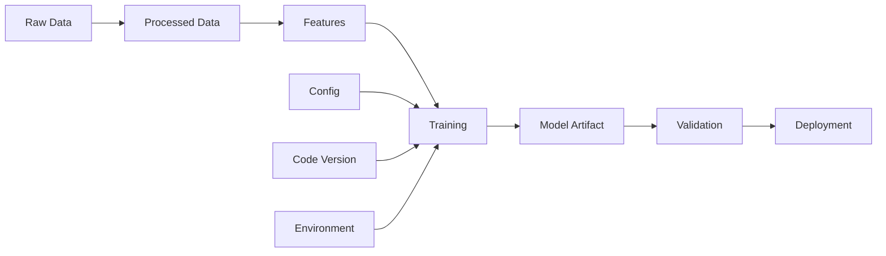

# Model Lineage Skill

## Objetivo

Rastrear linhagem completa de modelos ML: dados → features → treinamento → artefatos → deployment. Essencial para reprodutibilidade, debugging e compliance.

---

## Componentes da Linhagem



---

## Metadata Schema

### model_lineage.yaml

```yaml
lineage:
  model_id: "vitruviano-classifier-v1.2.3"
  created_at: "2024-01-15T10:30:00Z"

  # Code provenance
  code:
    repository: "https://github.com/Douglas0101/Project-Vitruviano"
    commit_sha: "abc123def"
    branch: "main"
    tag: "v1.2.3"
    dirty: false

  # Data provenance
  data:
    training_dataset: "s3://bucket/datasets/train_v5.parquet"
    validation_dataset: "s3://bucket/datasets/val_v5.parquet"
    data_version: "v5"
    num_samples: 50000
    data_hash: "sha256:..."
    schema_version: "1.0"

  # Training config
  training:
    config_file: "configs/train_prod.yaml"
    config_hash: "sha256:..."
    hyperparameters:
      learning_rate: 0.001
      batch_size: 32
      epochs: 100
      optimizer: "AdamW"
    random_seed: 42

  # Environment
  environment:
    python_version: "3.11.5"
    pytorch_version: "2.1.0"
    cuda_version: "12.1"
    requirements_hash: "sha256:..."
    hardware:
      gpu: "NVIDIA A100"
      gpu_count: 4

  # Results
  results:
    metrics:
      auc: 0.8526
      accuracy: 0.8134
      f1_score: 0.7892
    calibration:
      ece: 0.023
      temperature: 1.05
    training_time_hours: 4.5

  # Artifacts
  artifacts:
    model_path: "s3://bucket/models/v1.2.3/model.pth"
    model_hash: "sha256:..."
    onnx_path: "s3://bucket/models/v1.2.3/model.onnx"
    model_card: "docs/model_cards/v1.2.3.md"
```

---

## Script de Tracking

```python
#!/usr/bin/env python3
"""Model Lineage Tracker."""

import hashlib
import json
import subprocess
from dataclasses import dataclass, asdict
from datetime import datetime, timezone
from pathlib import Path


@dataclass
class CodeProvenance:
    repository: str
    commit_sha: str
    branch: str
    tag: str | None
    dirty: bool


def get_git_info() -> CodeProvenance:
    """Captura informações do Git."""
    def run_git(cmd: list[str]) -> str:
        result = subprocess.run(
            ["git"] + cmd,
            capture_output=True,
            text=True,
            check=False,
        )
        return result.stdout.strip()

    return CodeProvenance(
        repository=run_git(["remote", "get-url", "origin"]),
        commit_sha=run_git(["rev-parse", "HEAD"]),
        branch=run_git(["rev-parse", "--abbrev-ref", "HEAD"]),
        tag=run_git(["describe", "--tags", "--exact-match"]) or None,
        dirty=bool(run_git(["status", "--porcelain"])),
    )


def hash_file(path: Path) -> str:
    """Calcula hash SHA256 de arquivo."""
    hasher = hashlib.sha256()
    with open(path, "rb") as f:
        for chunk in iter(lambda: f.read(8192), b""):
            hasher.update(chunk)
    return f"sha256:{hasher.hexdigest()[:16]}"


def create_lineage_record(
    model_path: Path,
    config_path: Path,
    metrics: dict,
) -> dict:
    """Cria registro de linhagem."""
    code = get_git_info()

    return {
        "model_id": f"model-{code.commit_sha[:8]}",
        "created_at": datetime.now(timezone.utc).isoformat(),
        "code": asdict(code),
        "training": {
            "config_hash": hash_file(config_path) if config_path.exists() else None,
        },
        "results": {"metrics": metrics},
        "artifacts": {
            "model_path": str(model_path),
            "model_hash": hash_file(model_path) if model_path.exists() else None,
        },
    }
```

---

## Integração com MLflow

```python
import mlflow

def log_lineage_to_mlflow(lineage: dict):
    """Log de linhagem no MLflow."""
    with mlflow.start_run():
        # Code tracking
        mlflow.set_tag("git.commit", lineage["code"]["commit_sha"])
        mlflow.set_tag("git.branch", lineage["code"]["branch"])
        mlflow.set_tag("git.dirty", lineage["code"]["dirty"])

        # Config
        mlflow.log_params(lineage["training"].get("hyperparameters", {}))

        # Metrics
        for name, value in lineage["results"]["metrics"].items():
            mlflow.log_metric(name, value)

        # Artifacts
        if Path(lineage["artifacts"]["model_path"]).exists():
            mlflow.log_artifact(lineage["artifacts"]["model_path"])
```

---

## Model Card Template

```markdown
# Model Card: {model_name}

## Model Details
- **Model ID**: {model_id}
- **Version**: {version}
- **Created**: {created_at}
- **Authors**: {authors}

## Intended Use
{intended_use_description}

## Training Data
- **Dataset**: {dataset_name}
- **Version**: {data_version}
- **Samples**: {num_samples}
- **Features**: {num_features}

## Evaluation Metrics
| Metric | Value |
|--------|-------|
| AUC | {auc} |
| Accuracy | {accuracy} |
| F1 Score | {f1} |
| ECE | {ece} |

## Ethical Considerations
{ethical_considerations}

## Limitations
{limitations}

## Caveats and Recommendations
{caveats}
```

---

## Comandos

```bash
# Gerar linhagem
python .agent/skills/model-lineage/scripts/lineage_tracker.py \
    --model outputs/best_model.pth \
    --config configs/train.yaml \
    --output lineage.yaml

# Verificar reprodutibilidade
python .agent/skills/model-lineage/scripts/verify_lineage.py \
    --lineage lineage.yaml

# Comparar versões
python .agent/skills/model-lineage/scripts/compare_lineage.py \
    --old lineage_v1.yaml \
    --new lineage_v2.yaml
```

---

## Checklist de Reprodutibilidade

### Obrigatório
- [ ] Git commit SHA registrado
- [ ] Random seed fixado e documentado
- [ ] Dependências com versões pinadas
- [ ] Config de treinamento versionada
- [ ] Hash dos dados de treino

### Recomendado
- [ ] Docker image tag
- [ ] Hardware specs documentados
- [ ] Training logs preservados
- [ ] Intermediate checkpoints

### Avançado
- [ ] Feature store integration
- [ ] Data versioning (DVC)
- [ ] Experiment tracking (MLflow/W&B)
- [ ] Model registry

---

## Métricas de Governança

| Métrica | Target | Verificação |
|---------|--------|-------------|
| Lineage Coverage | 100% models | Audit |
| Reproducibility | < 1% variance | CI test |
| Model Card | Required | PR check |
| Data Version | Tracked | Lineage file |
