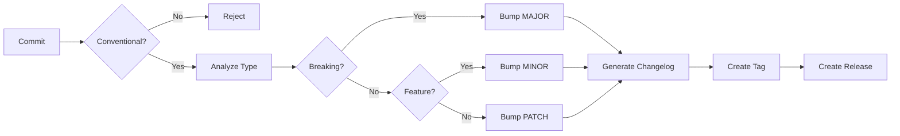

# Semantic Versioning Skill

## Objetivo

Automatizar versionamento semântico (SemVer) baseado em Conventional Commits, com detecção de breaking changes e geração de release notes.

---

## Especificação SemVer

```
MAJOR.MINOR.PATCH[-PRERELEASE][+BUILD]

MAJOR: Breaking changes (API incompatível)
MINOR: Novas features (backward compatible)
PATCH: Bug fixes (backward compatible)
```

**Exemplos:**
- `1.0.0` → `2.0.0` (breaking change)
- `1.0.0` → `1.1.0` (new feature)
- `1.0.0` → `1.0.1` (bug fix)
- `1.0.0-alpha.1` (pre-release)
- `1.0.0+build.123` (build metadata)

---

## Conventional Commits

### Formato

```
<type>[optional scope][!]: <description>

[optional body]

[optional footer(s)]
```

### Types e Bump

| Type | Descrição | Version Bump |
|------|-----------|--------------|
| `feat` | Nova feature | MINOR |
| `fix` | Bug fix | PATCH |
| `docs` | Documentação | - |
| `style` | Formatação | - |
| `refactor` | Refatoração | - |
| `perf` | Performance | PATCH |
| `test` | Testes | - |
| `build` | Build system | - |
| `ci` | CI/CD | - |
| `chore` | Outras mudanças | - |
| `feat!` ou `BREAKING CHANGE:` | Breaking | MAJOR |

---

## Comandos

### Verificar Commits

```bash
# Validar mensagens de commit
npx commitlint --from HEAD~5 --to HEAD

# Configuração
echo "module.exports = {extends: ['@commitlint/config-conventional']}" > commitlint.config.js
```

### Determinar Próxima Versão

```bash
# Com semantic-release (dry run)
npx semantic-release --dry-run

# Com git-cliff
git cliff --bumped-version
```

### Gerar Changelog

```bash
# Conventional Changelog
npx conventional-changelog -p angular -i CHANGELOG.md -s

# Git Cliff (Rust, mais rápido)
git cliff --output CHANGELOG.md
```

---

## Configuração

### commitlint.config.js

```javascript
module.exports = {
  extends: ['@commitlint/config-conventional'],
  rules: {
    'type-enum': [2, 'always', [
      'feat', 'fix', 'docs', 'style', 'refactor',
      'perf', 'test', 'build', 'ci', 'chore', 'revert'
    ]],
    'subject-case': [2, 'always', 'lower-case'],
    'header-max-length': [2, 'always', 72],
    'body-max-line-length': [2, 'always', 100],
  }
};
```

### .releaserc.json

```json
{
  "branches": ["main"],
  "plugins": [
    "@semantic-release/commit-analyzer",
    "@semantic-release/release-notes-generator",
    "@semantic-release/changelog",
    "@semantic-release/git",
    "@semantic-release/github"
  ]
}
```

### cliff.toml

```toml
[changelog]
header = """
# Changelog\n
"""
body = """

## {{ group | upper_first }}

- {{ commit.message | upper_first }} ({{ commit.id | truncate(length=7) }})


"""
footer = ""
trim = true

[git]
conventional_commits = true
filter_unconventional = true
commit_parsers = [
  { message = "^feat", group = "Features" },
  { message = "^fix", group = "Bug Fixes" },
  { message = "^doc", group = "Documentation" },
  { message = "^perf", group = "Performance" },
  { message = "^refactor", group = "Refactor" },
]
```

---

## Pre-commit Hook

```yaml
# .pre-commit-config.yaml
repos:
  - repo: https://github.com/compilerla/conventional-pre-commit
    rev: v3.0.0
    hooks:
      - id: conventional-pre-commit
        stages: [commit-msg]
```

---

## Breaking Change Detection

### Indicadores

1. **Exclamação no type**: `feat!: new API`
2. **Footer BREAKING CHANGE**:
   ```
   feat: new feature

   BREAKING CHANGE: old API removed
   ```
3. **Scope com !**: `feat(api)!: change endpoint`

### Automação

```bash
# Detectar breaking changes desde última tag
git log $(git describe --tags --abbrev=0)..HEAD --grep="BREAKING CHANGE" --oneline
git log $(git describe --tags --abbrev=0)..HEAD --grep="^.*!:" --oneline
```

---

## Workflow de Release



---

## Integração CI/CD

```yaml
# .github/workflows/release.yml
name: Release

on:
  push:
    branches: [main]

jobs:
  release:
    runs-on: ubuntu-latest
    steps:
      - uses: actions/checkout@v4
        with:
          fetch-depth: 0

      - name: Setup Node
        uses: actions/setup-node@v4
        with:
          node-version: 20

      - name: Install Dependencies
        run: npm install -g semantic-release @semantic-release/git @semantic-release/changelog

      - name: Release
        env:
          GITHUB_TOKEN: ${{ secrets.GITHUB_TOKEN }}
        run: npx semantic-release
```

---

## Métricas

| Métrica | Target | Verificação |
|---------|--------|-------------|
| Conventional Compliance | 100% | commitlint |
| Version Freshness | Per release | Git tags |
| Changelog Updated | Per release | File check |
| Breaking Change Noted | 100% documented | PR review |
