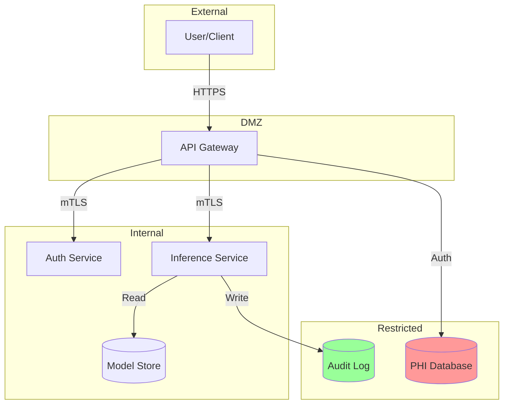

# Threat Modeling Skill

## Objetivo

Identificar, classificar e mitigar ameaças de segurança usando frameworks STRIDE e DREAD, com foco em sistemas ML e dados sensíveis (HIPAA).

---

## Framework STRIDE

| Categoria | Descrição | Exemplo ML |
|-----------|-----------|------------|
| **S**poofing | Falsificação de identidade | API sem autenticação |
| **T**ampering | Modificação de dados | Model weights injection |
| **R**epudiation | Negar ações realizadas | Sem audit logging |
| **I**nformation Disclosure | Vazamento de dados | Training data leakage |
| **D**enial of Service | Indisponibilidade | Model inference timeout |
| **E**levation of Privilege | Escalada de privilégios | Admin bypass |

---

## Attack Surface para ML Systems

### 1. Data Pipeline

```
┌─────────────────────────────────────────────────────────────┐
│                    DATA PIPELINE THREATS                     │
├─────────────────────────────────────────────────────────────┤
│  Ingestion         │  Processing        │  Storage           │
│  • Data poisoning  │  • Code injection  │  • Unauthorized    │
│  • Schema attacks  │  • Memory leaks    │    access          │
│  • Malformed input │  • Resource exhaust│  • Data exfil      │
└─────────────────────────────────────────────────────────────┘
```

### 2. Model Training

| Ameaça | STRIDE | Mitigação |
|--------|--------|-----------|
| Training data poisoning | Tampering | Data validation, provenance |
| Model extraction | Info Disclosure | Rate limiting, watermarking |
| Hyperparameter manipulation | Tampering | Config signing, audit |
| Compute hijacking | DoS | Resource quotas, monitoring |

### 3. Model Serving

| Ameaça | STRIDE | Mitigação |
|--------|--------|-----------|
| Adversarial inputs | Tampering | Input validation, robustness |
| Model theft | Info Disclosure | Obfuscation, access control |
| Inference bombing | DoS | Rate limiting, caching |
| Prompt injection | Tampering | Sanitization, guardrails |

---

## DREAD Scoring

Priorização de ameaças (1-10 cada):

| Fator | Descrição |
|-------|-----------|
| **D**amage | Quanto dano se explorado |
| **R**eproducibility | Facilidade de reproduzir |
| **E**xploitability | Facilidade de explorar |
| **A**ffected Users | Quantidade de usuários afetados |
| **D**iscoverability | Facilidade de descobrir |

```
Risk Score = (D + R + E + A + D) / 5
```

---

## Threat Model Template

### System Overview

```yaml
system:
  name: "Project Vitruviano"
  description: "ML-powered medical imaging classifier"
  data_classification: "PHI (HIPAA)"

components:
  - name: "API Gateway"
    trust_boundary: "external"

  - name: "Inference Service"
    trust_boundary: "internal"

  - name: "Model Storage"
    trust_boundary: "internal"

  - name: "Training Pipeline"
    trust_boundary: "internal"

  - name: "Audit Database"
    trust_boundary: "restricted"
```

### Data Flow Diagram



---

## Threat Catalog

### HIPAA-Specific Threats

| ID | Threat | STRIDE | DREAD | Mitigation |
|----|--------|--------|-------|------------|
| T001 | PHI exposure in logs | I | 8.2 | Log sanitization |
| T002 | Unauthorized model access | E | 7.8 | RBAC, audit |
| T003 | Training data breach | I | 9.0 | Encryption, access control |
| T004 | Missing audit trail | R | 8.0 | Immutable audit chain |
| T005 | Unencrypted data at rest | I | 7.5 | AES-256 encryption |

### ML-Specific Threats

| ID | Threat | STRIDE | DREAD | Mitigation |
|----|--------|--------|-------|------------|
| T101 | Model inversion attack | I | 6.5 | Differential privacy |
| T102 | Membership inference | I | 6.0 | DP-SGD training |
| T103 | Adversarial examples | T | 7.0 | Adversarial training |
| T104 | Model poisoning | T | 8.5 | Data validation |
| T105 | Model stealing | I | 6.8 | Rate limiting, watermarks |

---

## Security Controls Matrix

```yaml
controls:
  authentication:
    - control: "mTLS for service-to-service"
      threats: [T001, T002]
      status: implemented

    - control: "JWT with short expiry"
      threats: [S001, S002]
      status: implemented

  encryption:
    - control: "AES-256 for data at rest"
      threats: [T003, T005]
      status: implemented

    - control: "TLS 1.3 for data in transit"
      threats: [T001]
      status: implemented

  access_control:
    - control: "RBAC with least privilege"
      threats: [T002, E001]
      status: implemented

  monitoring:
    - control: "Immutable audit logging"
      threats: [T004, R001]
      status: implemented

    - control: "Real-time anomaly detection"
      threats: [T104, D001]
      status: planned
```

---

## Comandos

```bash
# Gerar relatório de ameaças
python .agent/skills/threat-modeling/scripts/threat_report.py \
    --system-config system.yaml

# Calcular DREAD scores
python .agent/skills/threat-modeling/scripts/dread_calculator.py \
    --threats threats.yaml

# Verificar controles
python .agent/skills/threat-modeling/scripts/control_checker.py \
    --controls controls.yaml
```

---

## Review Cadence

| Trigger | Ação |
|---------|------|
| New feature | Update threat model |
| Quarterly | Full review |
| Security incident | Immediate review |
| Dependency update | Control verification |
| Compliance audit | Full documentation |

---

## Métricas

| Métrica | Target | Verificação |
|---------|--------|-------------|
| Threats Identified | Comprehensive | Quarterly review |
| High DREAD (>7) Mitigated | 100% | Control matrix |
| Controls Implemented | >90% | Audit |
| Time to Mitigate Critical | <7 days | Tracking |
